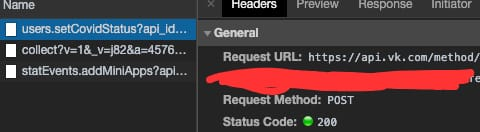

# VK-CovidStatus-Change
Автоматическая смена ковид статуса vk.com (смайлик после имени)
Для запуска необходимо задать TOKEN,  где его взять?
1) Перейдите по ссылке <a href = "https://vk.com/covid19"> ссылке.</a>
2) Вызываем панель разработчика, переходим в вкладку "Network" 
3) Выбираем людей из статусов(смайликов) не закрывая панель разработчика
4) В "Request URL" копируем часть адресной строки от access_token= до &expires_in , это и будет ваш токен
​
